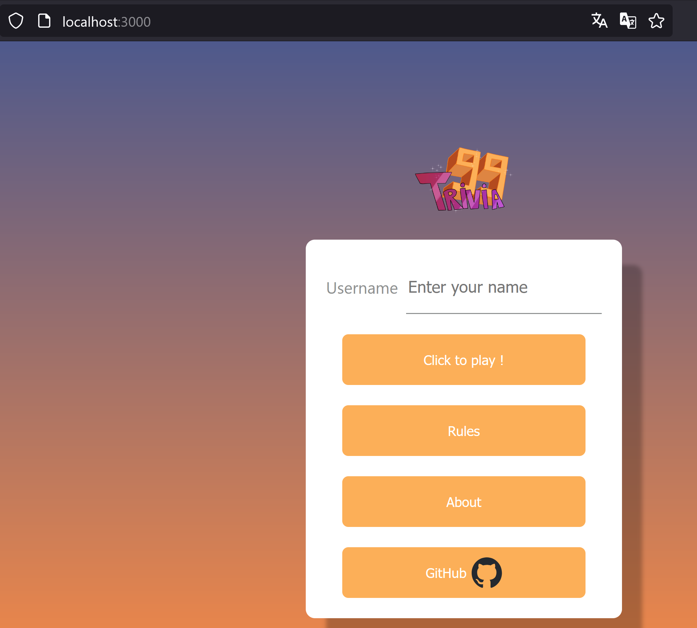
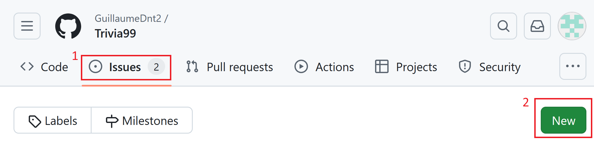
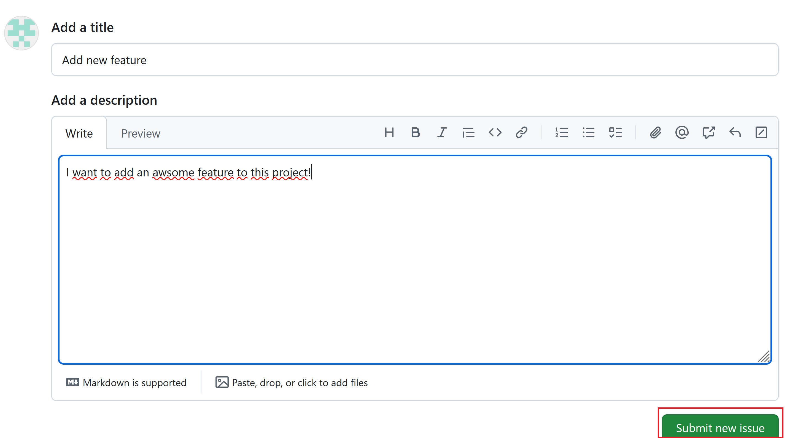
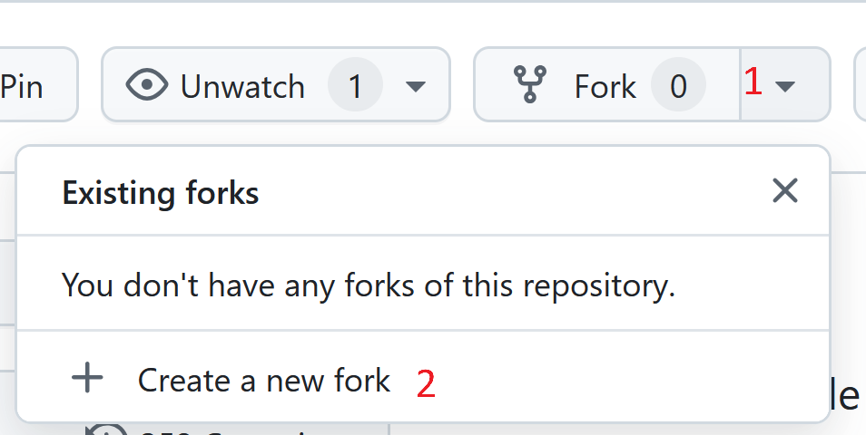
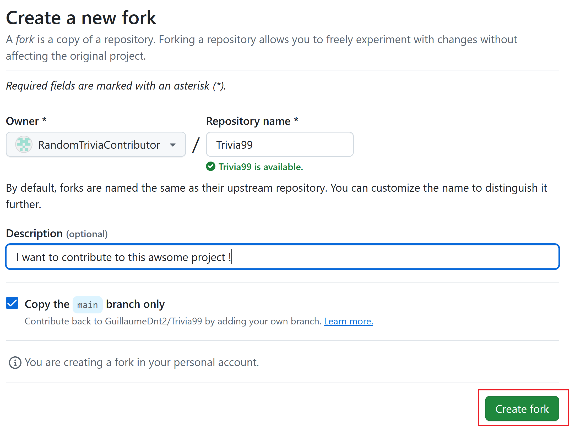
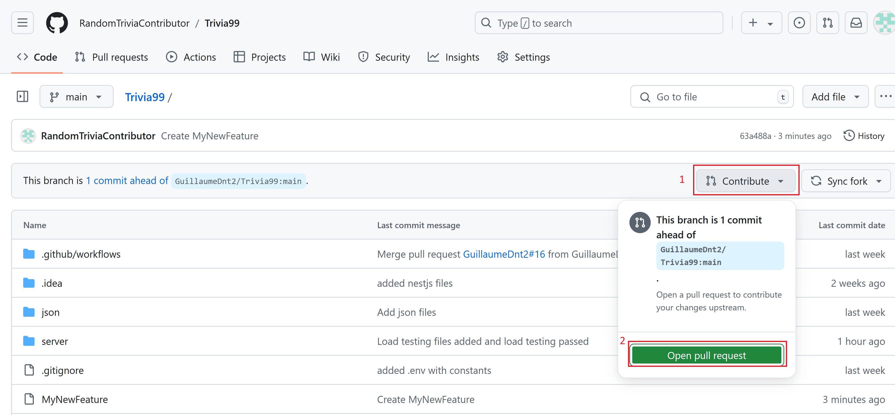
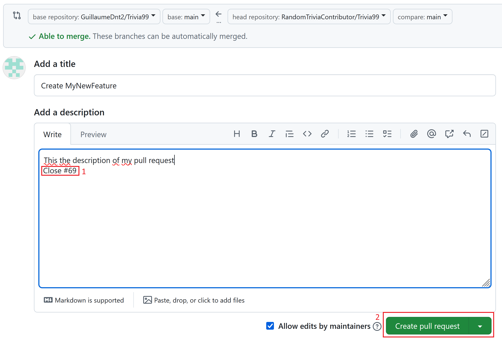
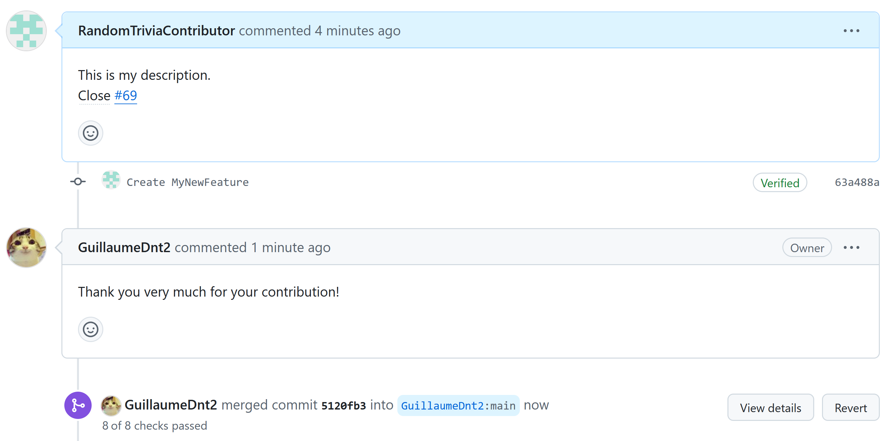

# Trivia99


Trivia 99 is a battle royal game with up to 99 players. To survive, you have to answer multiple-choice trivia questions. But be careful, if you wait too long, some questions will add up to your question's queue and if the queue number exceeds 7, you lose the game! Try to chain the right answers to grow your streak and attack your friends.

## Authors

- [GuillaumeDnt2](https://github.com/GuillaumeDnt2)
- [Neroil](https://github.com/Neroil)
- [VBonzon](https://github.com/vbonzon)
- [Tasticoco](https://github.com/Tasticoco)

This project has been developed during the course of the [HEIG-VD](https://heig-vd.ch) in the context of ***PDG***.

## Summary

- [Setup guide](#setup-guide)
- [How to contribute](#how-to-contribute)

## Setup guide

### Prerequisites

To run Trivia 99 on your computer, you must have [git](https://github.com/git-guides/install-git) and [npm with Node](https://docs.npmjs.com/downloading-and-installing-node-js-and-npm) installed.

### Quick Start

To run this application, you must have ports 3000 and 4000 available on your machine. You can check if these ports are in use by running `netstat -tuln | grep '3000\|4000'` on UNIX systems or `netstat -ano | findstr :3000 :4000` on Windows.

#### UNIX Systems (Linux or macOS)

Open a terminal and copy-paste the following commands:

```bash
git clone https://github.com/GuillaumeDnt2/Trivia99.git
cd ./Trivia99/server/frontend/src/utils
sed -i 's/trivia99.zapto.org/localhost/g' socket.js
cd ../..
npm i
npm run start&

cd ../backend
npm i
npm run start&
cd ../../..
```

#### Windows Systems

Open a PowerShell terminal and copy-paste the following commands:

```bash
git clone https://github.com/GuillaumeDnt2/Trivia99.git
cd .\Trivia99\server\frontend\src\utils
(Get-Content socket.js) -replace 'trivia99.zapto.org', 'localhost' | Set-Content socket.js
cd ..\..\
npm install
Start-Process powershell -ArgumentList "-NoExit", "-Command", "npm run start"

cd ..\backend
npm install
Start-Process powershell -ArgumentList "-NoExit", "-Command", "npm run start"
cd ..\..\..
```

After running these commands, wait for about a minute. The backend and frontend should be running in the background. The frontend should have also opened a page in your default web browser.

### Playing with Friends

If you want to play with friends on your local network:

1. Forward ports 4000 and 3000 on your router.
2. For security, consider using a VPN solution like TailScale to avoid making these ports publicly accessible.


If you have any issue with this quick start, please do check the step by step tutorial below

### Testing modifications

To test if your changes are working, you can run the tests. The test in the frontend only check if the routes to the different pages exist. The backend's test are more complex. To run the tests, you can do the following command either in the `frontend` or the `backend` directory:

```bash
npm run test
```
### Step by step setup of the projet

#### Download source code of the project

To download the source code, clone the repo by executing the following command in your bash terminal:

```bash
git clone https://github.com/GuillaumeDnt2/Trivia99.git
```

#### Download dependencies

The project is composed in two parts: the frontend and the backend. Both are located in the `server` directory. First, navigate to the backend directory:

```bash
cd server/backend
```

Then download the dependencies with npm by executing the following command:

```bash
npm install
```

or

```bash
npm i
```

Do same in the frontend directory :

```bash
cd ../frontend
npm install
```

#### Start the project

To start the project, you first need to change the address of the backend server. To do so, you need to go in the `utils` directory (from `frontend`) :

```bash
cd src/utils
```

Now you can open the `socket.js` file and modify the following line

```js
//const URL = 'http://localhost:4000';
const URL = 'http://trivia99.zapto.org:4000';
```

into

```js
const URL = 'http://localhost:4000';
//const URL = 'http://trivia99.zapto.org:4000';
```

Now you can run the project by returning to the frontend folder and doing this:

```bash
cd ../..
npm run start
```

If it runs correctly, you should be able to see a blank page at `http://localhost:3000/`. To display the actual home page you have to start the backend:

```bash
cd ../backend # You should be in ./server/backend now
npm run start
```

Now the home page should be available.



## How to contribute

### Create an issue

To contribute to Trivia 99, you can first open an issue to describe what feature you want to add. To do so, you can go on our [repo page](https://github.com/GuillaumeDnt2/Trivia99), go to the `Issue` tab (1) and click on `New` (2).



Then, write a title and a description of your feature and press on `Submit new issue`.



### Fork the repo

To begin to add your contribution you have to fork our repo. To do so, you can on our [repo page](https://github.com/GuillaumeDnt2/Trivia99) and click on the `Fork` button (1) and the click on `Create a new fork` (2).



Then on the next page, click on `Create fork`.



Now you can clone your freshly created repo and start adding feature to our project. 

### Open pull request

Once you are done with your changes, you can go on the GitHub page of your fork and click on `Contribute` (1) and then `Open pull request` (2).



On the next page, you can write the description (don't forget to **add link to your issue** (1)) of your pull request and then press `Create pull request` (2).



If your pull request is accepted, it will be merged into the project!



Once the merged is done, the CI/CD pipeline will automatically create a new image of the application and deploy it on our server.


### Thanks for contributing to Trivia 99! 🎉
