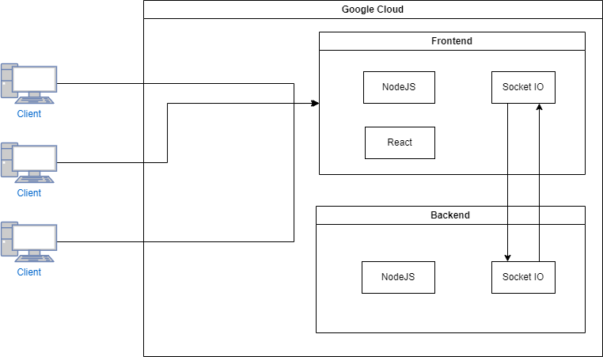

#### PDG 2024*
#### Auteurs : Edwin Häffner, Guillaume Dunant, Arthur Junod, Valentin Bonzon***

# Trivia 99

## Problématique
Les jeux télévisés de culture générale, qui étaient autrefois majoritairement populaire au sein des EMS et du troisième âge, retrouvent aujourd'hui un second souffle. 
La culture générale est en train de devenir une tendance, car elle permet de satisfaire la curiosité, d'entrainer la mémoire et d'apprendre sur notre monde.
Cependant, il est encore difficile de participer aux jeux comme "Question pour un champion" ou "Le Grand Slam", car le niveau y reste extrêmement élevé. 

Ces jeux télévisés arrivent souvent à insuffler un bon esprit de compétition et du suspense, car les joueurs peuvent être éliminés s'ils ne sont pas assez rapides ou ne connaissent pas la réponse. 
Il existe déjà plusieurs jeux de culture générale sur internet que l'on peut faire avec des amis ou le monde entier, mais rares sont ceux qui proposent cette même expérience de compétition. 

## Notre solution
Notre jeu **Trivia 99** permettra aux joueurs d'affronter d'autres joueurs sur leurs connaissances en culture générale, cinéma, jeux-vidéos, histoire, géographie et plus encore, les meilleurs joueurs seront les derniers survivants. Chaque joueur possède une pile qui se verra ajouter des questions à intervalles réguliers. Le but du jeu : éliminer le plus de question de sa pile pour éviter qu'elle soit remplie au maximum, le cas échéant terminera la partie du joueur. Dans le meilleur des cas, le joueur aura les connaissances nécessaires pour éliminer la question avant que la prochaine arrive. Pour les questions plus difficiles, une mauvaise réponse fera perdre du temps, la pile continuera à se remplir avec les questions suivantes.

Pour pimenter la partie, les joueurs qui répondent correctement à plusieurs questions à la suite pourront envoyer une nouvelle question à un autre joueur, augmentant la taille de sa pile. Les joueurs ciblés devront faire face aux questions supplémentaires en plus des questions habituelles. Ils devront faire preuve de rapidité et de bonne connaissance pour ne pas se laisser submerger par les questions.

## Processus de travail

### Description du projet
#### 1. Exigences Fonctionnelles
- **Une seule session de jeu public** : Les joueurs rejoignent une session publique et attendent que la partie commence, il faut au moins 2 joueurs prêts pour lancer la partie.
- **Système de questions** : Les questions sont tirées aléatoirement d'une API open source de questions de culture générale.
- **Système de pile de questions** : Chaque joueur possède une pile de questions, il doit répondre correctement à une question pour l'éliminer de sa pile, le joueur perd la partie si sa pile est pleine et qu'il reçoit une nouvelle question.
- **Système d'attaque** : Lorsqu'un joueur répond à plusieurs questions à la suite correctement sans erreurs, il accumule une série. À chaque série, le joueur peut envoyer une question à un autre joueur !
- **Thèmes aléatoires** : Les questions sont tirées aléatoirement parmi plusieurs thèmes.
- **Difficulté croissante** : Les questions deviennent de plus en plus difficile au fur et à mesure de la partie.
- **Session Guest** : Les joueurs peuvent juste choisir un pseudo et rejoindre une partie sans inscription.

#### 2. Exigences Non-Fonctionnelles
- **Jeu rapide** : Les parties doivent être rapides et dynamiques, les joueurs ne doivent pas attendre trop longtemps entre les questions et le site doit pouvoir distribuer rapidement et efficacement les questions à tous les utilisateurs.
- **Sécurité** : Les joueurs n'auront pas leurs addresses IPs exposées, les données personnelles seront protégées et le site sera en HTTPS.
- **Responsiveness** : Le site doit être utilisable sur mobile, tablette et ordinateur.
- **Intuitif** : Le jeu doit être facile à comprendre et à prendre en main pour les nouveaux joueurs.

### Description de l'architecture 

### Mockups

[Cliquez ici](https://www.figma.com/proto/isvynhVr1etaen0j4LjXOz/Trivia99?node-id=37-1763&t=nFKCpC0W7mNDkQ5C-1&scaling=min-zoom&content-scaling=fixed&page-id=37%3A621&starting-point-node-id=37%3A622)

### Landing Page
Accessible depuis ce lien : https://guillaumednt2.github.io/Trivia99/

### Description des choix techniques 

Nous avons choisi d'utiliser NodeJS pour le déploiement de notre application. Une grande partie de notre groupe a utilisé NodeJS lors du cours de WEB, ce qui nous permet de mettre en place relativement facilement les serveurs dont nous avons besoin. Nous nous sommes donc tourné également vers JavaScript, car ce language était aussi pratiqué durant le cours WEB. 

Le frontend et backend communiqueront grâce à des websockets (SocketIO) ce qui permet une communication simple et rapide. Il ne nous semblait pas pertinent de mettre en place un système de communication plus complexe, car les informations échangées ne consisteront que de questions, de noms/ids d'utilisateurs que nous voulons attaquer, etc. Donc d'information courte et simple à encoder/décoder.

Pour le choix du fournisseur Cloud, nous avons décidé d'utiliser Google Cloud, car leur offre d'essai nous permet de faire plusieurs choses intéressantes. 

Nous nous sommes tournés vers React afin de créer l'interface utilisateur pour sa simplicité d'utilisation et le fait que nous sommes, pour certains, déjà familier avec. 
### Description du processus de travail

Nous nous sommes répartis le travail dès le début du projet. 

Pour les premiers jours, voici la répartition :
- **Arthur** : Responsable de la landing page.
- **Edwin** : Responsable du mockup de l'application.
- **Guillaume** : Mise en place de l'architecture du projet.
- **Valentin** : Mise en place du système de pipeline CI/CD sur le projet GitHub.

La rédaction du rapport se fait en commun.

Pour la suite du projet, nous allons regarder ensemble les différentes parties sur lesquelles il faut avancer et nous nous répartirons les tâches indépendamment de si elles se trouvent sur le backend ou le frontend. Tout le monde donc agit comme un développeur full stack.

Pour la collaboration dans le code, pour chaque fonctionnalité nous allons créer une nouvelle issue et l'implémenter dans une branche dédiée. Une fois fonctionnelle, nous allons la fusionner avec la branche main grâce à une pull request.

Finalement la pipeline CI/CD nous permet d'automatiser les tests, le build et le déploiement sur DockerHub de l'image du frontend et du backend.
